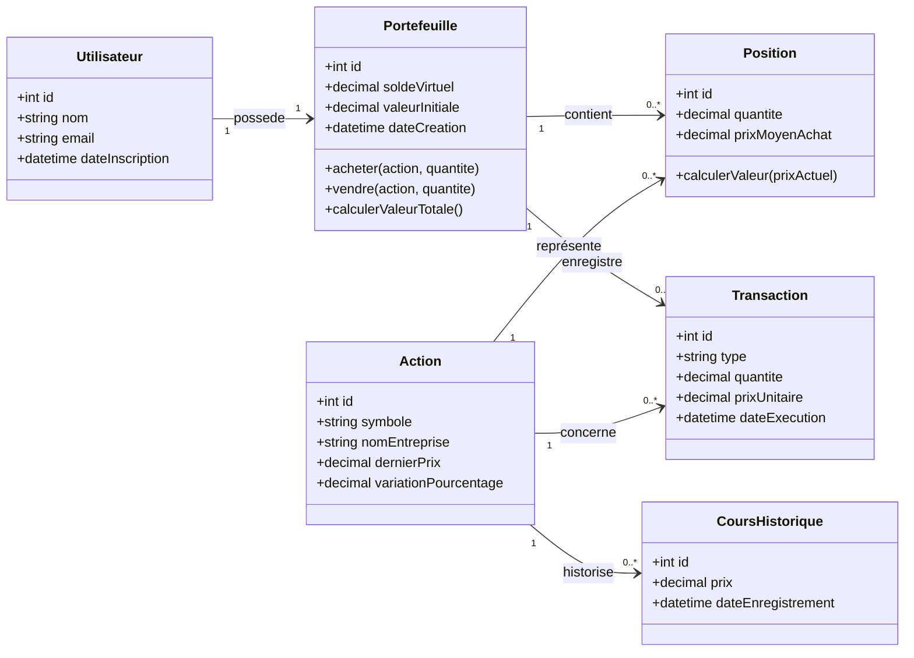

```mermaid
classDiagram
    direction LR

    class Utilisateur {
        +int id
        +string nom
        +string email
        +datetime dateInscription
    }

    class Portefeuille {
        +int id
        +decimal soldeVirtuel
        +decimal valeurInitiale
        +datetime dateCreation
        +acheter(action, quantite)
        +vendre(action, quantite)
        +calculerValeurTotale()
    }

    class Action {
        +int id
        +string symbole
        +string nomEntreprise
        +decimal dernierPrix
        +decimal variationPourcentage
    }

    class Position {
        +int id
        +decimal quantite
        +decimal prixMoyenAchat
        +calculerValeur(prixActuel)
    }

    class Transaction {
        +int id
        +string type
        +decimal quantite
        +decimal prixUnitaire
        +datetime dateExecution
    }

    class CoursHistorique {
        +int id
        +decimal prix
        +datetime dateEnregistrement
    }

    Utilisateur "1" --> "1" Portefeuille : possede
    Portefeuille "1" --> "0..*" Position : contient
    Action "1" --> "0..*" Position : représente
    Portefeuille "1" --> "0..*" Transaction : enregistre
    Action "1" --> "0..*" Transaction : concerne
    Action "1" --> "0..*" CoursHistorique : historise
```
